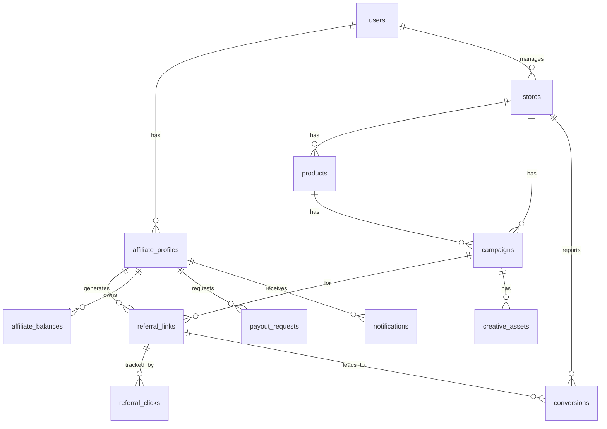

# Database Schema (PostgreSQL)

## Migrations (Alembic)

10 migrations in `backend/alembic/versions/`:

1. **001_users.py**: `users` table – id, email, password_hash, role (super_admin|admin|affiliate), is_active, created_at, last_login, email_verified, is_deleted (soft delete).
2. **002_affiliate_profiles.py**: `affiliate_profiles` – user_id FK, status (pending|approved|rejected|suspended), full_name, phone, bio, social_urls, payout_method, paystack_recipient_code, approved_by/at, terms_version_accepted, last_payout_at.
3. **003_stores_products.py**: `stores` – name, slug, website, admin_id FK, active. `products` – store_id FK, name, sku, price, currency, description, image, category, active.
4. **004_campaigns.py**: `campaigns` – name, product/store_id FK (null=global), commission_type (percent|fixed), rate, min_sale_amount, cookie_days, active, expires_at.
5. **005_referrals.py**: `referral_links` – affiliate_id, campaign_id, code (unique 10-alphanum), short_url, is_custom. `referral_clicks` – link_id FK, ip, user_agent, referrer, country, flagged.
6. **006_conversions.py**: `conversions` – referral_link_id FK, external_order_id, sale_amount, commission_earned, status (pending|approved|rejected|paid), store_id, source.
7. **007_earnings_payouts.py**: `affiliate_balances` – affiliate_id UNIQUE, pending/approved/paid_out. `payout_requests` – affiliate_id, amount, status, paystack_transfer_code, recipient_code.
8. **008_platform_settings.py**: `platform_settings` – key (PK), value (e.g. default_commission_rate, min_payout_threshold).
9. **009_creative_assets.py**: `creative_assets` – campaign_id FK, type (banner|video), url, size.
10. **010_notifications.py**: `notifications` – affiliate_id FK, title, message, read, created_at.

Run: `alembic upgrade head`

## ERD (Simplified Mermaid)

## Key Queries/Views (in code)

- Affiliate performance aggregates
- Platform analytics (views planned)

Soft deletes on users/products.